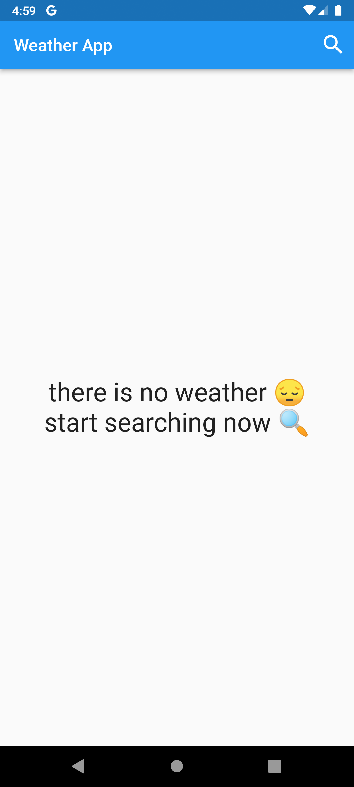

# weather_app

The Weather App is a mobile application built using Flutter. It provides users with current weather conditions, hourly forecasts, and daily forecasts for their selected location. The app fetches data from a weather API and displays it in an easy-to-read format.

## Home Screen

## Search A City

## No Weather Screen

